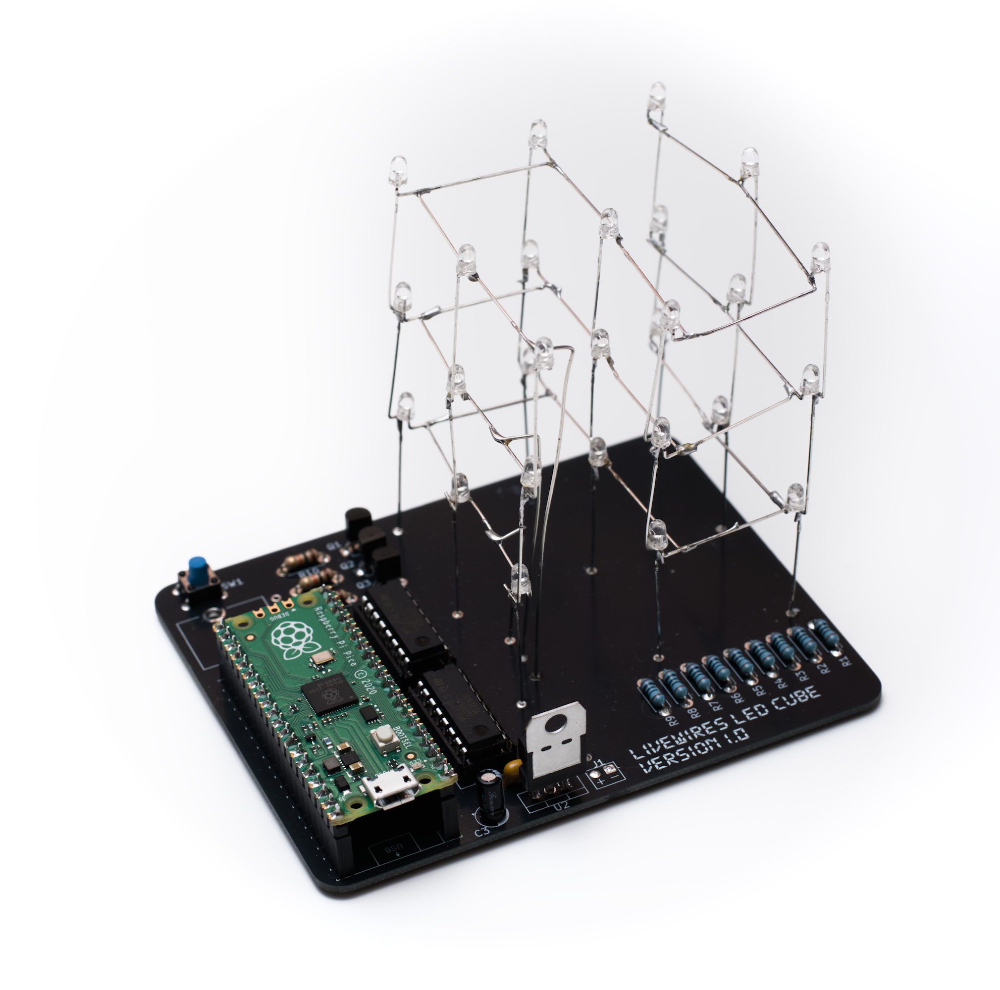
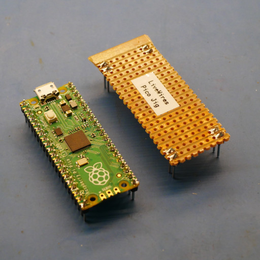
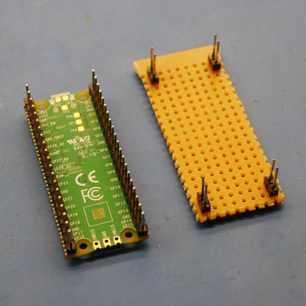

# LiveWires LED Cube

A 3x3x3 cube with completely programmable animations using the [animator](http://livewires.org.uk/led-cube)

 

## Own an LED cube? Start here!

Well done for building your LED cube! Here's where you can find all the information about it.


## How it works

The cube has 27 LEDs arranged in a 3×3×3 grid. Rather than wiring each LED individually, they share connections by layer — only one layer is switched on at a time, but they cycle through fast enough (~98 times per second) that all three appear lit at once.

This cycling is handled by the Pico's PIO hardware, which runs independently in the background so Python doesn't have to worry about the timing. Python's only job is to advance through the animation frames at the right speed and update which LEDs should be on.

Animations are loaded from `animations.json`. Each animation has a list of frames and a framerate. Pressing the button on GP16 skips to the next animation.

### Putting your own animations on

Use our [animation tool](http://livewires.org.uk/led-cube)! You can load the existing animations from the cube using the "Load JSON" button at the bottom. All you need to do is plug the pico in over USB and it'll appear as a removable drive. 

Once you're ready to try your animations on the cube, press "Download JSON" and move the `animations.json` file to the pico. Note, it must be named exactly that, if you've got several copies (e.g. `animations (1).json`) you'll have to rename it on the device. 

### Troubleshooting

That should be all you need. If you get stuck, feel free to get in touch with a leader, or post an issue here on github. 

If you've bricked your cube by changing something, don't worry, it should be easy to fix. Just download the contents of the "code" folder in github and copy it across to the device. 

## Setting up for the camp?

This should only need to be done by the leader running the sessions on the camp. This is what needs doing in advance:

* PCB needs ordering
* Components need kitting
* Pico needs soldering
* Pico needs initial software installing
* Jig needs making

#### PCB 

At the minute, this is a non-etch project. The PCB is ordered from JLCPCB or a similar service using the gerber files. These can be found in the version's output folder (e.g. [here](led-cube-pcb/releases/lw-led-cube_1.0/lw-led-cube_1.0_Gerbers.zip)).

These will take a few weeks to arrive so needs doing in plenty of time!

#### Components

Components list is in the BOM. For example, the revision 1 BOM can be found at [macropad-rev1/output/macropad-rev1-BOM.ods](led-cube-pcb/releases/lw-led-cube_1.0/full-project-bom_1.0.ods). 

#### Soldering the Pico

To save money, we're ordering the Pi Pico un-soldered. This means a leader will have to solder the two 20-pin headers to the Pico. They should protrude from the bottom of the Pico (i.e. the side with no components on), so the solder goes on the top of the board (i.e. the side _with_ the components on). 

#### Setting up the Pico

CircuitPython needs installing on the Pico, and then our code needs copying. The version used for development was 10.2.1, which is [copied into this repo](adafruit-circuitpython-raspberry_pi_pico-en_GB-10.2.1.uf2). 

You should now be able to copy the contents of the [code](code) folder onto the new CIRCUITPY drive. 


##### 1. Flash CircuitPython

Hold the **BOOTSEL** button on the Pico, plug it into USB, then release BOOTSEL.  
The Pico will appear as a USB drive called **RPI-RP2**.

Copy the firmware onto that drive:

```
adafruit-circuitpython-raspberry_pi_pico-en_GB-10.2.1.uf2  →  RPI-RP2
```

The Pico will reboot automatically and reappear as **CIRCUITPY**.

##### 2. Copy the code

Copy the contents of the `code/` folder to the root of the CIRCUITPY drive:

```
code/
├── code.py           →  CIRCUITPY/code.py
├── animations.json   →  CIRCUITPY/animations.json
└── lib/
    └── adafruit_pioasm.mpy  →  CIRCUITPY/lib/adafruit_pioasm.mpy
```

The Pico will run `code.py` automatically as soon as the files are in place.


#### Making a Jig

Soldering the pico headers to the PCB is much easier for the YP if they can physically join both 20-pin connectors together, the right distance apart. This can be done by attaching the connectors to a Pico before soldering them, but this risks breaking the Pico. So a jig can be made using header pins and a bit of veroboard. 

Use a Pico to copy the exact spacing of the pins. It should look something like this:

 

