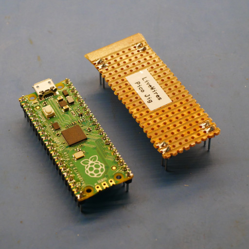

# LiveWires Macro Pad

## Own a macro pad? Start here!

Well done for building your macro pad! Here's where you can find all the information you need to start programming it yourself.

### How it works

The macro pad runs on a Raspberry Pi Pico. If you plug in the macro pad to a computer, it should do two things. Firstly, it'll act as the macro pad it's supposed to! Secondly, it should also act as a tiny memory stick, creating a new drive on your computer that you can browse the files on.

This contains two files - code.py and keys.py - plus a couple of folders.

Unless you're a Python wizard, we recommend you don't touch the folders, or code.py. These are what makes it all work as it should and you risk breaking things/

However, keys.py is where you can tell the macro pad which buttons do what. So this is the one to edit. You should be able to open it in your favourite text editor, make changes, save them and then unplug and plug back in the macro pad. However there's an easier way...

### Using Thonny

This isn't strictly required, but it is highly recommended. The best software we've found to edit the macro pad code is called Thonny. You should be able to download and install it from here: https://thonny.org/

Once installed, it should have a button in the bottom right corner that you can click to choose the option that mentions Circuit Python. On a Windows machine it probably says something like "CircuitPython (generic)  **·** COM3". Click that one.

Once you've done that, you can press File -> Open, and open the keys.py file that's on the device. 

Thonny will highlight the different bits of the code in different colours, which should help you understand the changes you want to make. 

Once you've made the changes to the file, press save. To run the new code immediately, you should just be able to press the red "stop" sign followed by the green "play" sign in the top bar of the Thonny window.

### Troubleshooting

That should be all you need. If you get stuck, feel free to get in touch with a leader, or post an issue here on github. 

If you've bricked your macropad by changing something, don't worry, it should be easy to fix. Just download the contents of the "code" folder in github and copy it across to the device. 

## Setting up a macro pads for the camp?

This should only need to be done by the leader running the sessions on the camp. This is what needs doing in advance:

* PCB needs ordering
* Components need kitting
* Pico needs soldering
* Pico needs initial software installing
* Jig needs making

#### PCB 

At the minute, this is a non-etch project. The PCB is ordered from JLCPCB or a similar service using the gerber files. These can be found in the version's output folder (e.g. [here](macropad-rev1/output/macropad-rev1.zip)).

These will take a few weeks to arrive so needs doing in plenty of time!

#### Components

Components list is in the BOM. For example, the revision 1 BOM can be found at [macropad-rev1/output/macropad-rev1-BOM.ods](macropad-rev1/output/macropad-rev1-BOM.ods). 

The key switches can be ordered from a variety of places. For quick UK stock, mechboards are good, and the [gateron switches](https://mechboards.co.uk/collections/switches/products/gateron-blue?variant=41710358528205) are sensibly priced. In general the blue switches will give the clickiest feedback. For bulk numbers, keychron seems cheap, but it's coming from China so may take a while. 

The key caps are from AliExpress. They will also take a while to arrive. 

#### Soldering the Pico

To save money, we're ordering the Pi Pico un-soldered. This means a leader will have to solder the two 20-pin headers to the Pico. They should protrude from the bottom of the Pico (i.e. the side with no components on), so the solder goes on the top of the board (i.e. the side _with_ the components on). 

#### Setting up the Pico

CircuitPython needs installing on the Pico, and then our code needs copying. 

Detailed instructions for installing CircuitPython on the Pico can be found [here](https://learn.adafruit.com/getting-started-with-raspberry-pi-pico-circuitpython/circuitpython). The version used for development was 9.0.4. To summarise in case of a dead link:
* While holding the BOOTSEL button on the pico down, plug it in to a computer using the USB cable
* Copy the CircuitPython uf2 file onto the RPI-RP2 drive that appears
* The RPI-RP2 drive should disappear and a CIRCUITPY drive should appear. 

You should now be able to copy the contents of the [code](code) folder onto the new CIRCUITPY drive. 

#### Making a Jig

Soldering the pico headers to the PCB is much easier for the YP if they can physically join both 20-pin connectors together, the right distance apart. This can be done by attaching the connectors to a Pico before soldering them, but this risks breaking the Pico. So a jig can be made using header pins and a bit of veroboard. 

Use a Pico to copy the exact spacing of the pins. It should look something like this:

